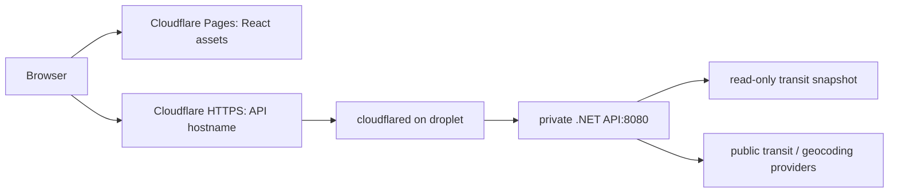

# Production: Cloudflare Pages + private Tunnel API

Client: **https://moovit.joaocyrino.com** and admin: **https://moovit-admin.joaocyrino.com** on separate Cloudflare Pages projects. API: **https://moovit-api.joaocyrino.com** through Cloudflare Tunnel to the shared droplet. Only pushes/merges to **main** run Actions; staging and pull requests trigger nothing.

## Architecture and access control



- Production exposes no Moovit host ports, Caddy labels or membership in the shared `proxy` network. Existing apps keep their shared Caddy routes.
- The API and connector share an **internal** Docker `origin` network. Each has separate Internet egress; the API still needs outbound provider requests.
- The API checks its actual TCP peer against the connector's private IP **before** processing forwarded headers. It rejects other peers and missing/invalid `CF-Connecting-IP` or non-HTTPS forwarded requests.
- The client IP used for rate limiting comes only from `CF-Connecting-IP` received through that trusted connector. Arbitrary `X-Forwarded-For` does not grant access or change the rate-limit bucket.
- CORS permits only `https://moovit.joaocyrino.com`. CORS controls browser access; the public API remains callable through Cloudflare without user authentication.
- Only GET `/api/health/live` and `/api/health/ready` allow container-local loopback probes. Other loopback requests are rejected in production.
- The tunnel token stays in the droplet `.env`. GitHub gets a separate **Pages deployment** token and the existing SSH/GHCR credentials. Neither token enters the React bundle.
- Tunnel connectivity is outbound; it needs TCP/UDP port 7844 egress. The droplet's existing SSH access and other apps' inbound ports stay unchanged. A host administrator with Docker access can change the configuration; this does not isolate the app from root.

## 1. Create the client and admin Cloudflare Pages projects

Cloudflare DNS for `joaocyrino.com` is already active. Create two **Direct Upload** Pages projects with production branch `main`:

| App | Pages project | Custom domain |
| --- | --- | --- |
| Client | `moovit-de-cria` | `moovit.joaocyrino.com` |
| Admin | `moovit-de-cria-admin` | `moovit-admin.joaocyrino.com` |

Keep the existing client Pages project if already configured. GitHub Actions controls
publishing. Both projects must exist before pushing; deployment preflight checks them
before building or changing the droplet. The admin is currently just a public Hello world
page with no API calls or administrative operations.

To create the project using Wrangler, run locally with the Cloudflare Account ID and a Pages API token supplied as shell environment variables (never committed):

```bash
npx --yes wrangler@4.148.0 pages project create moovit-de-cria --production-branch=main
npx --yes wrangler@4.148.0 pages project create moovit-de-cria-admin --production-branch=main
```

Wrangler reads `CLOUDFLARE_ACCOUNT_ID` and `CLOUDFLARE_API_TOKEN`. Create the token with **Account → Cloudflare Pages → Edit**, scoped to your account. The Account ID is shown in the Cloudflare dashboard.

In each Pages project's **Custom domains**, attach its matching domain from the table above. Remove the old Moovit `A`/`AAAA` records pointing at the droplet when making this cutover; let Pages create its CNAME. Do not create only a DNS CNAME without attaching the domain to Pages. If the dashboard requires an initial deployment first, finish the first Actions deployment, then attach the domain; the initial site also has a `pages.dev` URL. Only the custom frontend origin is permitted by the API.

There can be a short transition while the first Pages upload and DNS/domain certificate activation complete. Subsequent frontend deployments are published after API readiness succeeds.

## 2. Create the Cloudflare Tunnel

In the Cloudflare dashboard, open **Networking → Tunnels** (or **Zero Trust → Networks → Connectors** in the older dashboard), create a remotely managed **Cloudflared** tunnel called `moovit-de-cria` and select Docker. Copy its token **only onto the droplet**, as described below. Do not run the dashboard's Docker command: Compose manages the connector.

Add its **Published application** route:

| Setting | Value |
| --- | --- |
| Public hostname | `moovit-api.joaocyrino.com` |
| Service type | HTTP |
| Service URL | `app:8080` (equivalent to `http://app:8080`) |

Cloudflare creates the proxied tunnel DNS record. Do not point this hostname at the droplet IP or attach it to Caddy. Keep the HTTP Host header unchanged, so the API receives `moovit-api.joaocyrino.com`. Enable **Always Use HTTPS** for this hostname/zone. Keep **Pseudo IPv4** disabled or in Add Header mode, preserving the real `CF-Connecting-IP`.

Use the first-level `moovit-api.joaocyrino.com`: standard Universal SSL covers it. The deeper `api.moovit.joaocyrino.com` would need additional certificate coverage on a normal full-zone setup.

Create a Cloudflare **Cache Rule** to bypass caching for the API hostname. Responses already use `Cache-Control: no-store`; do not override it with Cache Everything. Cloudflare WAF/rate-limit rules may be added for this hostname when traffic warrants them; do not put an interactive challenge on every API request.

## 3. Update the droplet-owned configuration

Keep the existing deploy account and `/opt/moovit-de-cria/.env`. Merge the new fields from [.env.production.example](../.env.production.example); **do not overwrite** your existing server settings:

```dotenv
APP_HOSTNAME=moovit.joaocyrino.com
API_HOSTNAME=moovit-api.joaocyrino.com
CLOUDFLARE_TUNNEL_TOKEN=YOUR_REAL_TUNNEL_TOKEN
APP_MEMORY_LIMIT=512m
TUNNEL_MEMORY_LIMIT=128m
IMPORT_MEMORY_LIMIT=384m
```

The file must belong to your actual `DEPLOY_USER`, with mode 0600:

```bash
chmod 600 /opt/moovit-de-cria/.env
```

Docker Compose v2, `flock`, `curl` and GNU `stat` must exist on the droplet. Node.js is included in the application image for one-off imports and health checks; no host Node.js or Python installation is required. The deployment discovers the connector's private IP automatically; **do not hardcode `TRUSTED_PROXY_IP`** in `.env`. The existing `moovit-de-cria_transit_data` volume and project name are preserved.

GitHub never uploads/downloads this `.env`. Retaining unrestricted SSH/Docker access means the deploy account can technically read it. The application does not receive the tunnel token; only the connector does.

The connector is one additional small service with a 128 MiB memory cap, not a reservation. The real timetable/API still needs RAM: a previous real route request used roughly 316 MiB. On the 1 GiB shared host, retain the existing swap/headroom plan; moving static assets to Pages does not eliminate timetable memory usage. Check `free -h` and `swapon --show` before cutover. Deployment still installs the CI-prepared GTFS through a one-off 64 MiB job, without processing the whole feed on the server.

## 4. Configure GitHub Actions

Use the **production** GitHub environment. Keep the existing deployment secrets:

| Secret | Value |
| --- | --- |
| `DEPLOY_HOST` | Droplet IPv4/SSH hostname |
| `DEPLOY_USER` | Existing Docker-capable deploy user |
| `DEPLOY_SSH_KEY` | Existing authorized private deployment key |
| `DEPLOY_SSH_KNOWN_HOSTS` | Verified server host-key line |
| `GHCR_USERNAME` | Account with read access to the image package |
| `GHCR_TOKEN` | Token with `read:packages` for the droplet pull |

Add these **production secrets**:

| Secret | Value |
| --- | --- |
| `CLOUDFLARE_API_TOKEN` | Pages Edit API token from step 1 |
| `CLOUDFLARE_ACCOUNT_ID` | Your Cloudflare account ID |

Production Pages variables (both have these defaults):

| Variable | Default |
| --- | --- |
| `CLOUDFLARE_PAGES_PROJECT` | `moovit-de-cria` |
| `CLOUDFLARE_ADMIN_PAGES_PROJECT` | `moovit-de-cria-admin` |

The existing Pages Edit token and Account ID can deploy both projects in that account;
no additional tunnel or droplet service is needed for the admin.

Public hostname overrides must be **repository variables**, so the tested artifact and API use the same addresses:

| Repository variable | Default |
| --- | --- |
| `APP_HOSTNAME` | `moovit.joaocyrino.com` |
| `API_HOSTNAME` | `moovit-api.joaocyrino.com` |
| `ADMIN_HOSTNAME` | `moovit-admin.joaocyrino.com` |
| `GTFS_URL` | `https://dados.mobilidade.rio/gtfs/schedule` |

`DEPLOY_PATH` defaults to `/opt/moovit-de-cria` and `DEPLOY_PORT` to `22`; those can be production variables. The old `CADDY_CONTAINER` variable is no longer used by this app. Never put the tunnel token in GitHub or a `VITE_` variable.

For a new server key, obtain `/etc/ssh/ssh_host_ed25519_key.pub` over trusted SSH or DigitalOcean console. `DEPLOY_SSH_KNOWN_HOSTS` contains `YOUR_DEPLOY_HOST ssh-ed25519 ACTUAL_PUBLIC_KEY`; use `[HOST]:PORT` for a custom SSH port. Existing verified secrets remain valid.

## 5. Push and deploy

After the Pages project, tunnel route, server `.env` and GitHub settings are ready:

```bash
cd ~/code/moovit-de-cria
git add .
git commit -m "Deploy frontend to Pages and API through Cloudflare Tunnel"
git push origin main
```

The workflow checks deployment configuration, runs backend/frontend/importer tests, builds the **API-only** image with official GTFS, builds both React apps, and browser-tests the **exact client Pages artifact** with the disposable API image. The admin artifact is separately smoke-tested at mobile/desktop widths; it only renders Hello world and makes no API requests. Production-origin tests exercise peer rejection, header spoofing, CORS and real per-client rate limits. The fixture is not bundled as production data.

It publishes the image digest and saves the two tested static artifacts. The droplet pulls the image, installs the snapshot, starts the connector, discovers its private IP and starts the API. Readiness checks cover both local API/tunnel and the public API **through Cloudflare**. Two Pages publish jobs deploy their respective saved artifacts only after the API deploy succeeds. No rebuild happens in the publish job.

Rollback restores the previous image using the **new private Compose configuration**, never the old public Caddy configuration. During the first migration, an old image may lack cross-origin CORS support; a failed cutover can therefore leave the previous API private but the frontend unavailable until fixed. Once a successful Cloudflare release exists, image rollback retains that release's behavior. API and Pages are separate deployments, not an atomic cross-provider transaction; a Pages failure leaves the API deployed and the previous version of that Pages site. Client/admin publish independently. Re-running that failed Pages job publishes the same tested artifact.

Check:

```bash
curl --fail https://moovit-api.joaocyrino.com/api/health/ready
curl -I https://moovit.joaocyrino.com
curl -I https://moovit-admin.joaocyrino.com
```

Direct droplet HTTP(S) access no longer routes this API. Normal users access the public API hostname through Cloudflare. Do not close global 80/443 ports, because other shared apps still use them.

## Refresh and focused diagnostics

For the small host, use **Re-run all jobs** on the main workflow to prepare fresh GTFS in CI. Re-running only a failed deploy reuses its original image/snapshot.

On a larger host with enough import headroom, manual refresh remains available:

```bash
bash /opt/moovit-de-cria/current/refresh-data.sh
```

The optional first argument is a custom deploy path; there is no Caddy argument now. It uses the deployment lock and preserves the previous snapshot on import failure.

For a failed deploy:

```bash
docker logs --tail 60 moovit-de-cria-app-1
docker logs --tail 60 moovit-de-cria-tunnel-1
docker inspect --format '{{with index .NetworkSettings.Networks "moovit-de-cria_origin"}}{{.IPAddress}}{{end}}' moovit-de-cria-tunnel-1
```

Do not paste `.env` or full `docker inspect`/`compose config` output: the connector environment contains the tunnel token. A disconnected SSH session means completion is unknown; inspect `/opt/moovit-de-cria/current` before retrying.

## Local development

`npm run dev` starts .NET (5193), client (4193) and admin (4194). Client uses Vite's `/api` proxy; admin is independent. Local `docker compose up --build` still serves only client + API from the combined container; run `npm run dev:admin` separately for admin. No Cloudflare credentials are required locally. `VITE_API_ORIGIN` defaults to unset; production sets it at build time to `https://moovit-api.joaocyrino.com`. The service worker caches the local app shell/assets only, never cross-origin API/GPS responses or external map tiles.

## References

- [Pages direct upload from CI](https://developers.cloudflare.com/pages/how-to/use-direct-upload-with-continuous-integration/)
- [Pages custom domains](https://developers.cloudflare.com/pages/configuration/custom-domains/)
- [Cloudflare Tunnel setup](https://developers.cloudflare.com/tunnel/get-started/)
- [Tunnel token environment variable](https://developers.cloudflare.com/cloudflare-one/networks/connectors/cloudflare-tunnel/configure-tunnels/run-parameters/)
- [Universal SSL coverage](https://developers.cloudflare.com/ssl/edge-certificates/universal-ssl/limitations/)
